
<h1 align="center">基于的星巴克咖啡店管理系统+vue</h1>

## 简介
星巴克咖啡店管理系统：角色分为管理员、用户；功能涵盖用户注册、订单管理、商品信息、购物车、用户评论、新闻信息及后台管理，支持图片上传和信息更新等交互功能。    --计算机毕业设计源码；毕设源码；java毕业设计源码

## 联系方式

<h3 align="center">获取完整代码与数据库文件 + 微信：deepguan QQ: 86050149 QQ群: 783742310</h3>

<h3 align="center">可帮忙远程部署 包运行成功！提供远程部署、修改代码、设计文档指导、代码讲解等服务！</h3>

## 功能介绍（完整见运行截图）
管理员： 基本功能：登录，注册，退出 系统管理：管理员管理、用户管理、商品信息管理、订单管理 商品管理：商品新增、详细信息编辑、库存管理、商品评价管理 用户信息管理：查看用户基本信息、会员等级编辑 其它功能：银行选择与支付确认，更新用户信息，退出登录

用户： 页面导航：首页、新闻信息、商品信息、个人中心、购物车、后台管理 登录注册：支持用户注册和登录，用户信息录入与管理 个人中心：查看和修改个人信息、收藏的商品、订单历史 支付：选择银行进行支付，查看订单支付状态 商品浏览与购买：商品列表、搜索、详细信息、购物车加入、立即购买 评价功能：商品评论与回复、查看用户评论、上传评价图片

## 运行截图
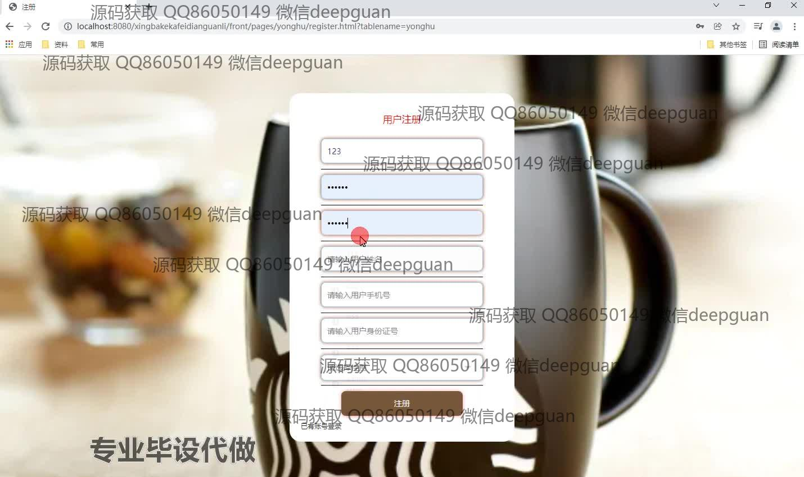
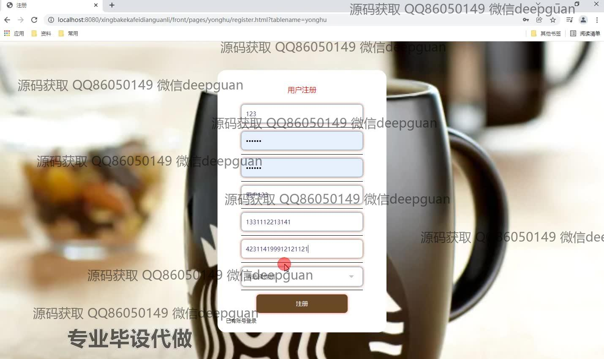
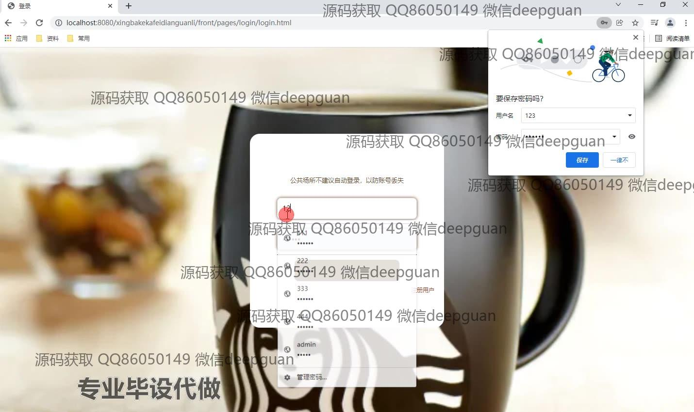
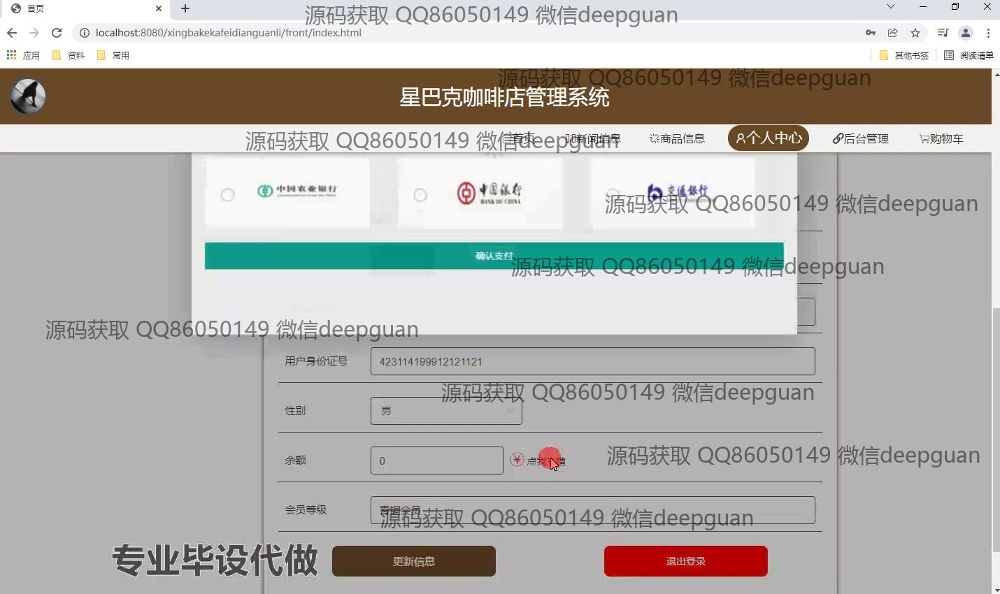
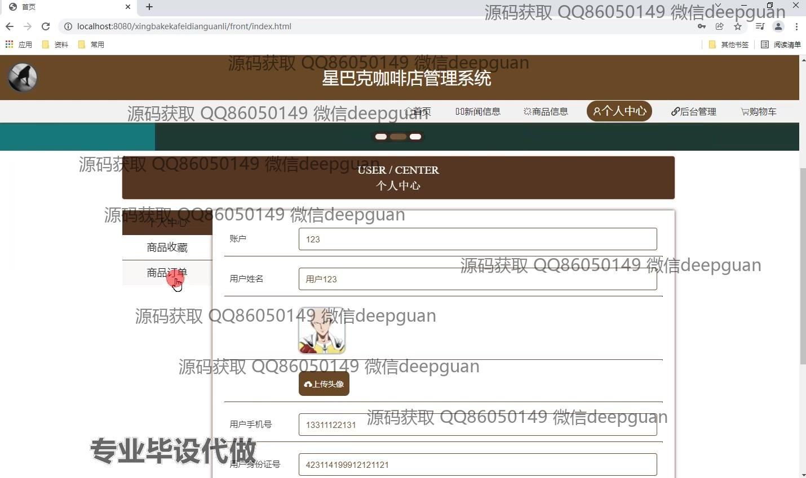

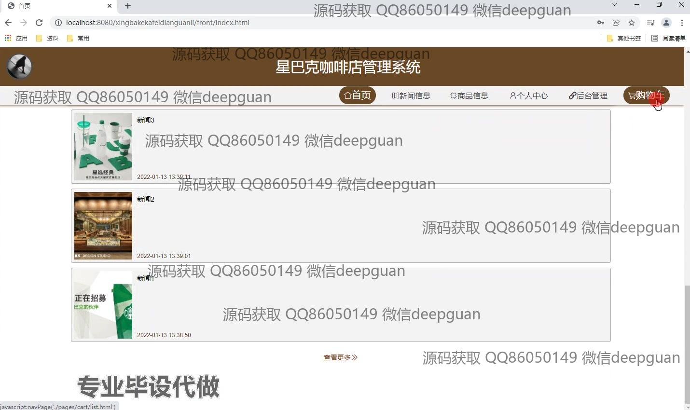
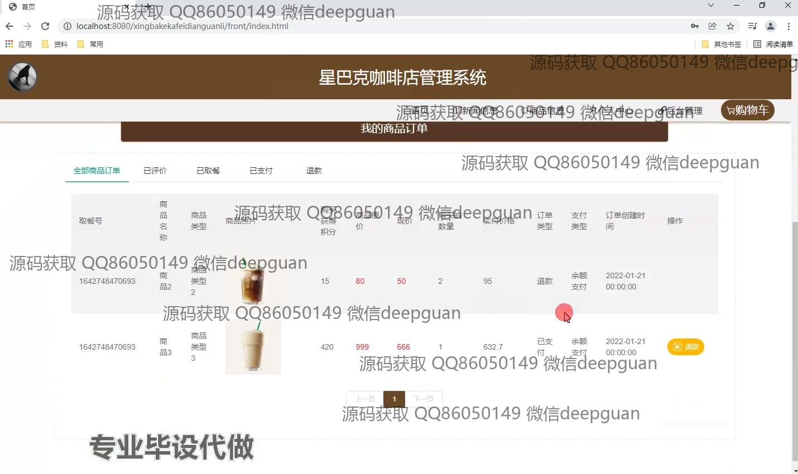
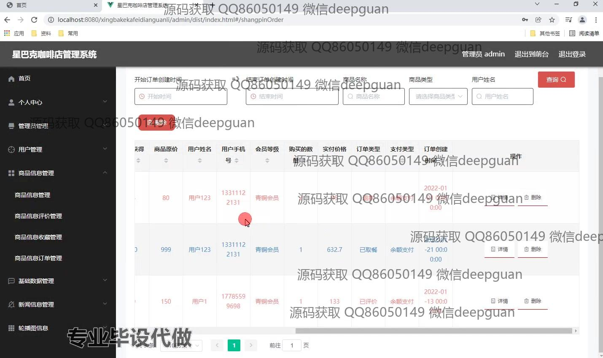
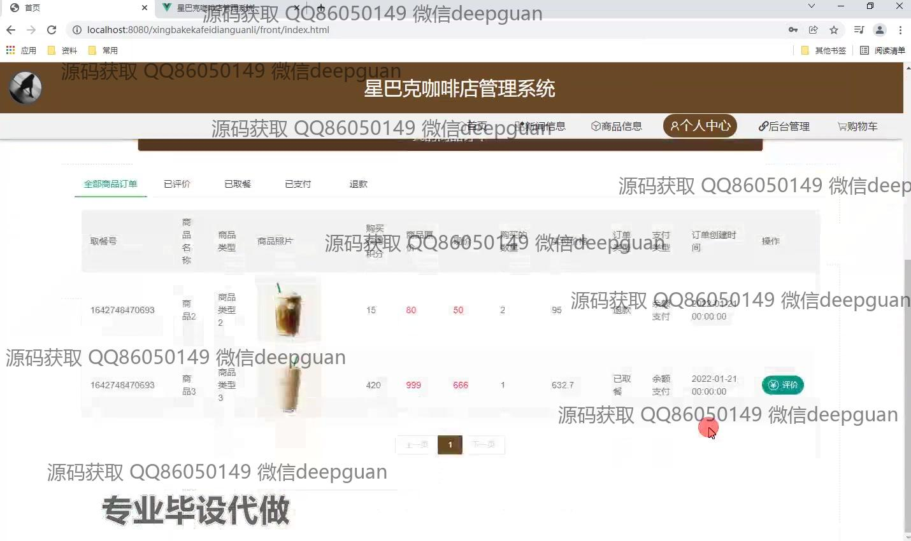
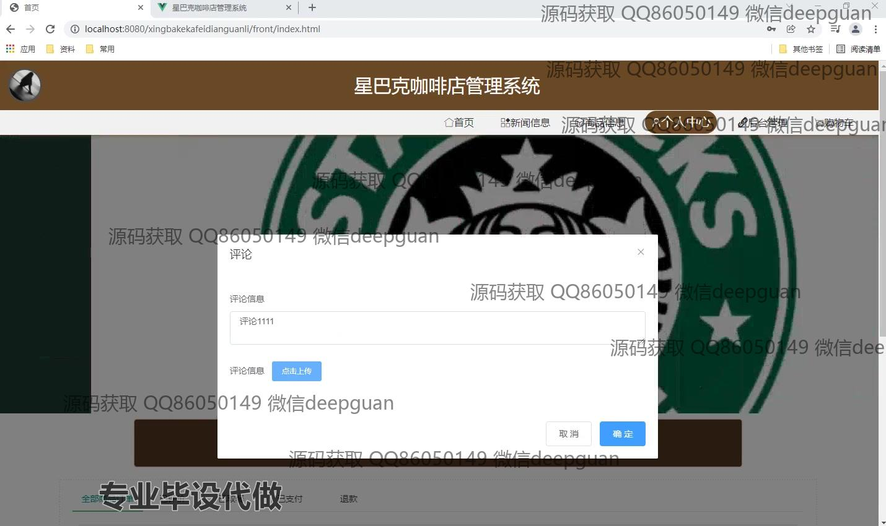
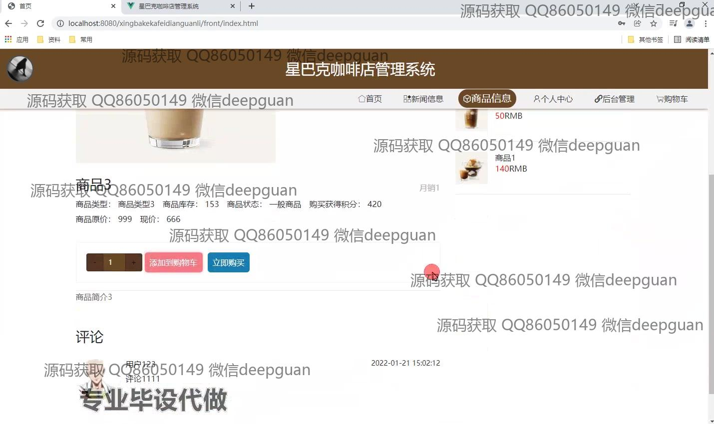
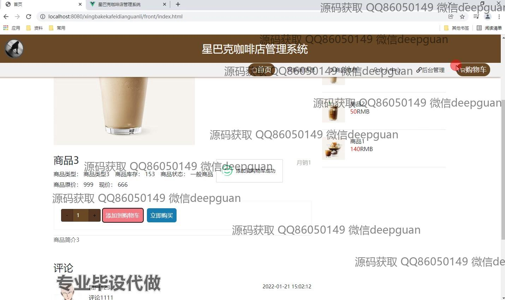
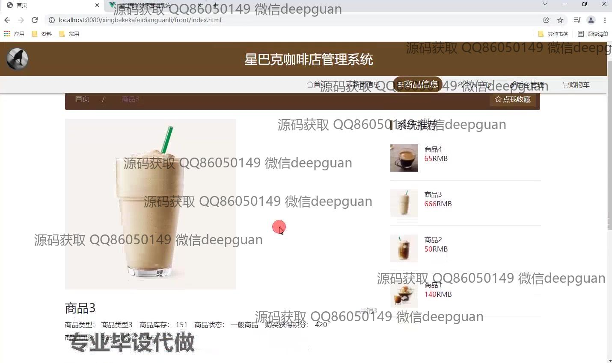
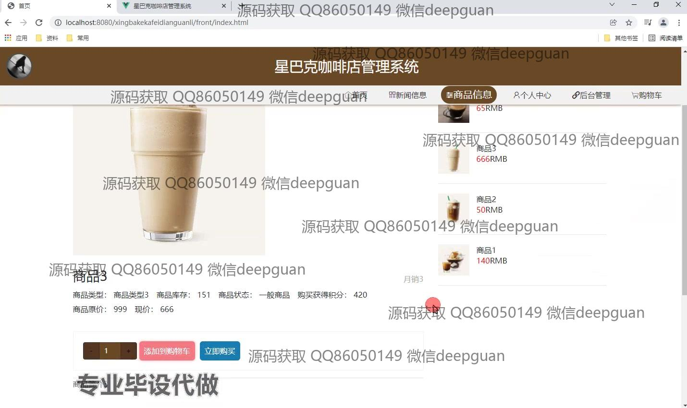
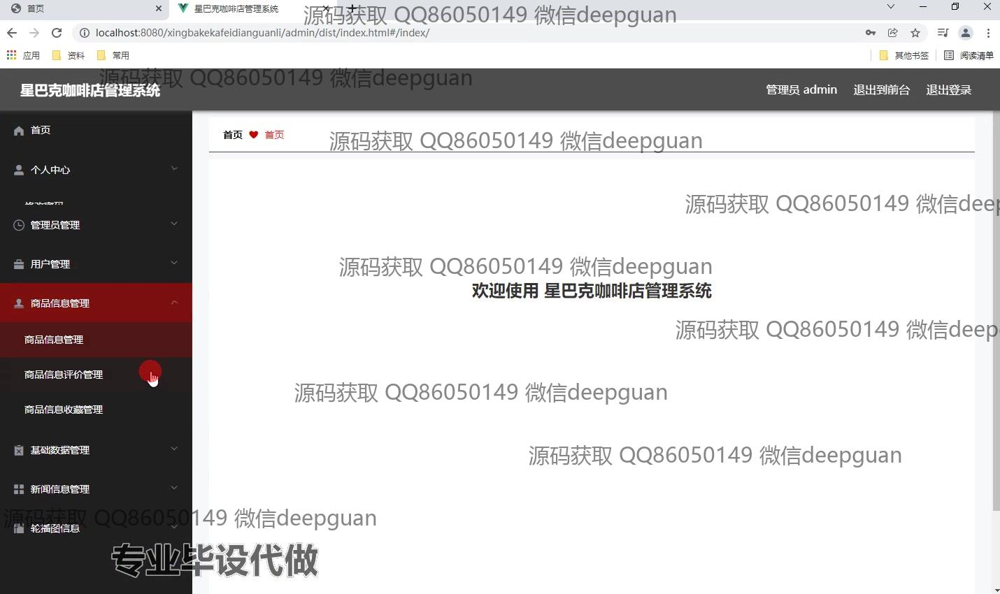
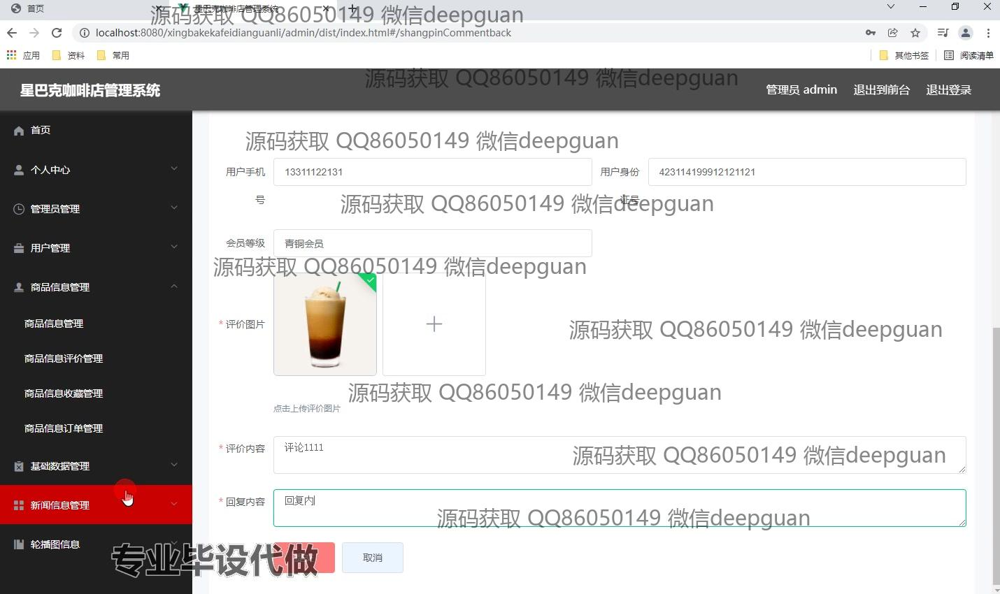
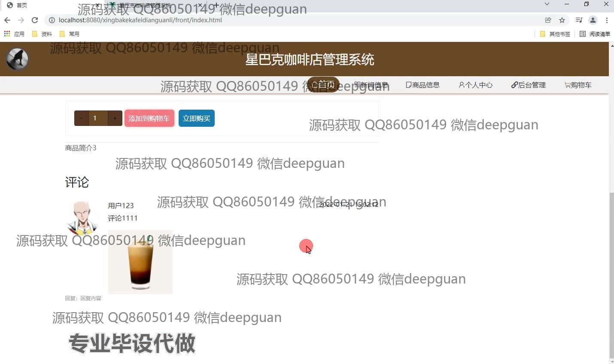

本代码来源于网络,仅供学习参考使用!

